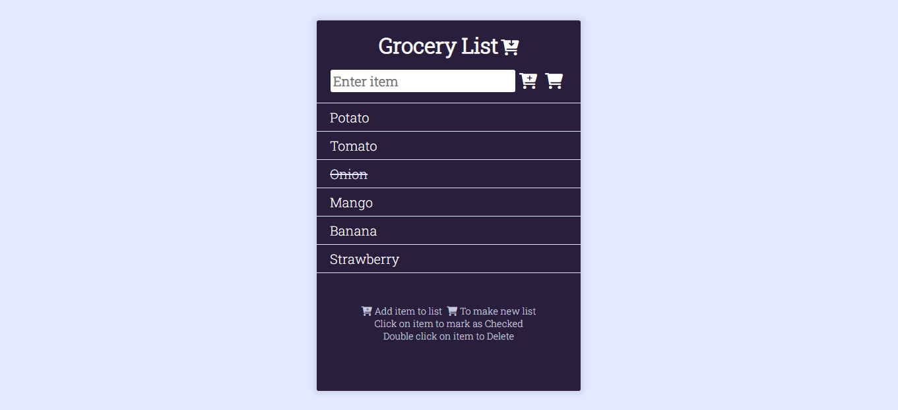
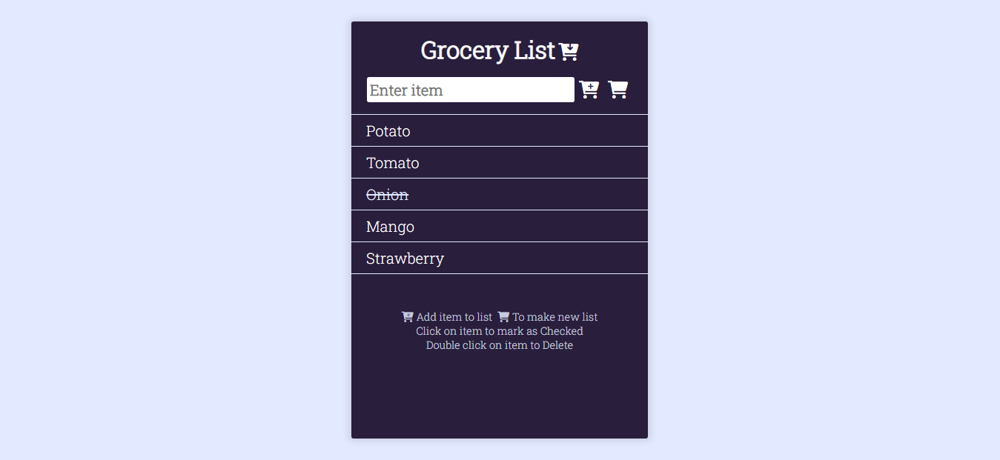
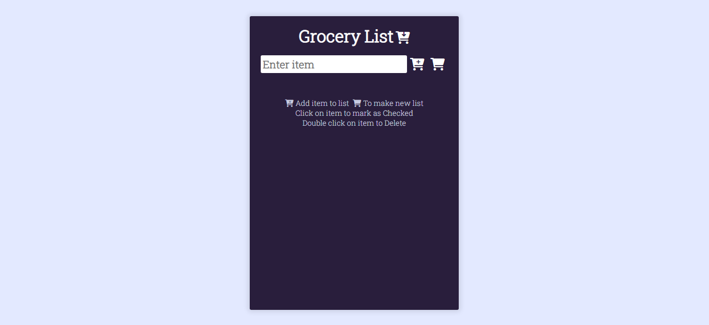

# grocery-list

It is a simple webpage where you can list down the grocery list. It helps user to maintain the grocery list. It use local storage for storing the data of the user.

## Screenshot

## [Live Demo](https://AkshayManiar.github.io/grocery-list/)

### Features:

- User can add new grocery items
- User can view all list of grocery items
- User can mark as checked for a particular grocery item
- User can delete any particular grocery item

## Credits

- [Font Awesome](https://fontawesome.com)(Icons)
- [Christian Robertson](https://fonts.google.com/specimen/Roboto+Slab?query=roboto+sla)(Fonts)
